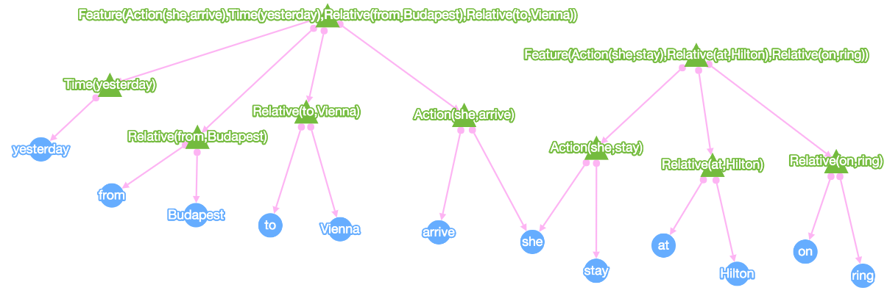
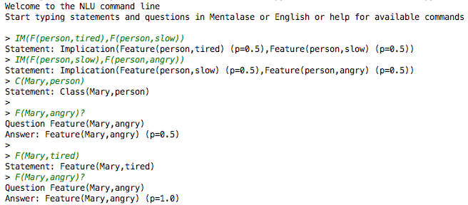
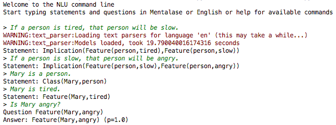

# nlu
Natural Language Understanding

# requirements
You need Python 3.5
For parsing statements in English, you need the SpaCy library installed and models for English downloaded. See https://spacy.io/docs/#getting-started

# cli
Run ```python3 cli.py``` to get a command line. Type ```help``` for available options.

# visualize concept stores
Use ```working_memory``` or ```question_store``` (```wm``` or ```qs```) in the CLI to dump a graph representation of the Working Memory or the Question Store contents.
Copy paste the json to https://szroland.github.io/nlu/graph/ to get a visual representation of concepts and their relationships.

```She arrived yesterday from Budapest to Vienna. She stayed at the Hilton on the Ring.```


# examples

## mentalase



## english


